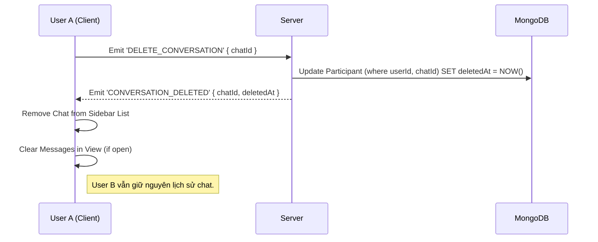

# Tài Liệu Thiết Kế Flow Xóa Đoạn Chat (Delete Conversation Flow)

Tài liệu này mô tả quy trình "Xóa đoạn chat" theo yêu cầu: **Xóa đoạn chat ở phía người dùng yêu cầu, nhưng dữ liệu tin nhắn vẫn tồn tại cho các thành viên khác.**

Cơ chế này thường được hiểu là:

1.  **Ẩn lịch sử tin nhắn cũ:** User sẽ không thấy các tin nhắn trước thời điểm xóa.
2.  **Ẩn đoạn chat khỏi danh sách:** Đoạn chat sẽ biến mất khỏi sidebar cho đến khi có tin nhắn mới.

---

## 1. Thay đổi Database (Prisma Schema)

Chúng ta cần lưu trữ trạng thái "đã xóa đến thời điểm nào" cho **từng người tham gia** (Participant) thay vì sửa đổi bảng Message hay Chat chung.

Đề xuất sửa đổi file `server/prisma/schema.prisma` tại model `Participant`.

```prisma
model Participant {
  id       String   @id @default(auto()) @map("_id") @db.ObjectId
  userId   String   @db.ObjectId
  chatId   String   @db.ObjectId
  // ... các trường hiện tại

  // [MỚI] Thời điểm người dùng xóa đoạn chat.
  // - Khi lấy tin nhắn: Chỉ lấy tin nhắn có createdAt > deletedAt (nếu deletedAt không null).
  // - Khi lấy danh sách chat: Chỉ hiển thị chat nếu có tin nhắn mới nhất (updatedAt) > deletedAt.
  deletedAt DateTime?

  // ... relations
}
```

**Logic hoạt động:**

- Khi User A xóa chat: Update `Participant` của User A, set `deletedAt = now()`.
- Các tin nhắn cũ vẫn trong DB, User B vẫn thấy bình thường.
- User A query tin nhắn: Hệ thống filter `Message.createdAt > Participant.deletedAt`.

---

## 2. Định Nghĩa Sự Kiện Socket (Socket Events)

Sử dụng file `event.const.ts`.

| Tên Sự Kiện            | Hướng            | Payload (Dữ liệu kèm theo)            | Mô tả                                         |
| :--------------------- | :--------------- | :------------------------------------ | :-------------------------------------------- |
| `DELETE_CONVERSATION`  | Client -> Server | `{ chatId: string }`                  | Client yêu cầu xóa cuộc trò chuyện này.       |
| `CONVERSATION_DELETED` | Server -> Client | `{ chatId: string, deletedAt: Date }` | Server xác nhận xóa thành công cho Client đó. |

_Lưu ý: Không cần emit sự kiện cho các thành viên khác vì hành động này chỉ ảnh hưởng cá nhân._

---

## 3. Chi Tiết Luồng Xử Lý (Detailed Flow)

### Bước 1: Client (User) thao tác

1.  Người dùng chọn "Xóa đoạn chat" từ menu.
2.  Client gọi sự kiện socket `DELETE_CONVERSATION`.

    _Code giả định (Client):_

    ```typescript
    socket.emit("DELETE_CONVERSATION", {
      chatId: "chat_Id_123",
    });
    ```

### Bước 2: Server Xử lý

1.  Server lắng nghe `DELETE_CONVERSATION`.
2.  Tìm record `Participant` tương ứng với `userId` (từ socket auth) và `chatId`.
3.  **Update Database:**
    - Cập nhật trường `deletedAt` của `Participant` thành thời điểm hiện tại (`new Date()`).
4.  **Phản hồi Client:**

    - Emit lại `CONVERSATION_DELETED` cho **chính socket đó** (hoặc room của user đó để đồng bộ nếu login nhiều thiết bị).

    _Code giả định (Server):_

    ```typescript
    socket.on("DELETE_CONVERSATION", async ({ chatId }) => {
      const userId = socket.data.user.userId;

      // Update thời điểm xóa cho participant
      await prismaService.participant.updateMany({
        where: {
          chatId: chatId,
          userId: userId,
        },
        data: {
          deletedAt: new Date(),
        },
      });

      // Báo lại cho user đó biết thành công để cập nhật UI
      io.to(userId).emit("CONVERSATION_DELETED", {
        chatId,
        deletedAt: new Date(), // hoặc lấy giá trị vừa update
      });
    });
    ```

### Bước 3: Client Cập nhật UI

Khi nhận sự kiện `CONVERSATION_DELETED`:

1.  **Xóa khỏi danh sách chat:** Loại bỏ item tương ứng khỏi state danh sách chat bên trái (Sidebar).
2.  **Nếu đang mở đoạn chat đó:**
    - Xóa rỗng danh sách tin nhắn hiện tại trên UI.
    - Hoặc điều hướng người dùng về trang mặc định (trang trống).

### Bước 4: Xử lý Logic Hiển Thị (Quan trọng)

Đây là phần logic cần thay đổi ở các API lấy dữ liệu (REST API) hoặc khi Socket init:

1.  **API Get Chat List (`/api/chats`):**

    - Cần filter: Nếu `Participant.deletedAt` tồn tại, chỉ trả về Chat nếu `Chat.lastMessage.createdAt > Participant.deletedAt`. Nếu tin nhắn cuối cùng cũ hơn thời điểm xóa -> Coi như chat rỗng/đã xóa -> Không trả về.

2.  **API Get Messages (`/api/chats/:id/messages`):**

    - Luôn thêm điều kiện where: `createdAt: { gt: Participant.deletedAt }`.

3.  **Khi có tin nhắn mới (Realtime):**
    - Nếu User A nhận tin nhắn mới từ User B cho chat đã xóa.
    - Server emit `NEW_MESSAGE`.
    - Client User A thấy tin nhắn mới -> Chat sẽ tự động "hiện lại" lên đầu danh sách (vì tin nhắn mới > deletedAt).
    - Cần đảm bảo logic Client: Nếu chat chưa có trong list (do bị ẩn) thì khi nhận tin nhắn mới phải fetch lại thông tin chat để hiển thị.

---

## 4. Rủi ro và Cân nhắc (Risks & Considerations)

1.  **Phân trang (Pagination) & Performance:**

    - Khi query danh sách tin nhắn (`/api/chats/:id/messages`), việc filter `createdAt > deletedAt` có thể ảnh hưởng đến kết quả phân trang (limit/offset hoặc cursor). Cần đảm bảo filter được áp dụng _trước_ khi limit để user luôn nhận đủ số lượng tin nhắn một lần load (ví dụ: load 20 tin).
    - Nếu `Participant.deletedAt` được dùng nhiều, cần đảm bảo `createdAt` của `Message` và `deletedAt` được index hợp lý nếu dữ liệu lớn (Prisma/MongoDB thường index `_id` có chứa timestamp, nhưng query range trên field riêng biệt nên cẩn thận).

2.  **Đồng bộ đa thiết bị (Multi-device Sync):**

    - Mặc dù socket emit `CONVERSATION_DELETED`, nếu user đang offline ở thiết bị khác, khi online lại cần fetch lại danh sách chat để đồng bộ trạng thái ẩn.

3.  **Chat "Ma" (Ghost Chat):**

    - Trường hợp mạng lag: User A xóa chat -> `deletedAt` updated. Đúng lúc đó User B gửi tin nhắn.
    - Nếu tin nhắn đến _sau_ khi update `deletedAt` -> Chat hiện lại (Đúng logic).
    - Nếu tin nhắn đến _trước_ vài mili-giây nhưng client chưa kịp cập nhật UI -> User A thấy tin nhắn đó rồi nó bị ẩn đi (Chấp nhận được).

4.  **Quyền riêng tư (Privacy):**
    - Đây là tính năng "Xóa lịch sử phía người dùng" (Clear History). Tin nhắn **vẫn nằm trong Database**. Cần làm rõ với người dùng đây không phải là "Thu hồi" (Unsend) hay xóa vĩnh viễn.

---

## Tóm tắt Flow Chart


